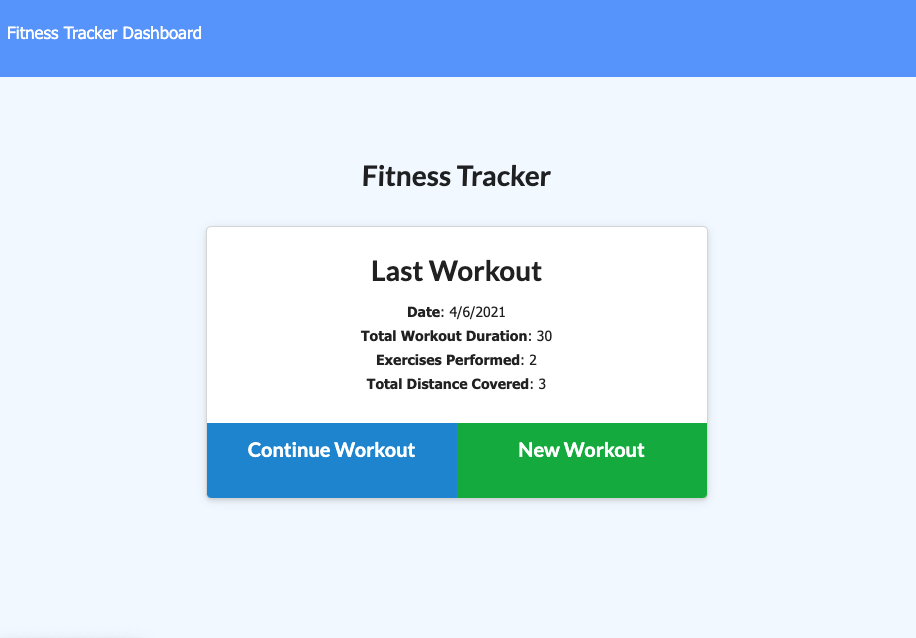

<h1 align="center">Workout Tracker 🏋️</h1>

### 🏠 https://workout-tracker-cr.herokuapp.com/

 

# Install

Open the above link in your browser.
 
 

# Usage

 
 
 

User can create and track daily workouts. Multiple exercises can be logged for a workout on a given day. The app tracks the name,
type, weigght, sets, reps, and duration of exercise. If the exercise is cardio, the distance traveled is tracked.

# Description

This app uses a Mongoose schema and handles routes with Express.
